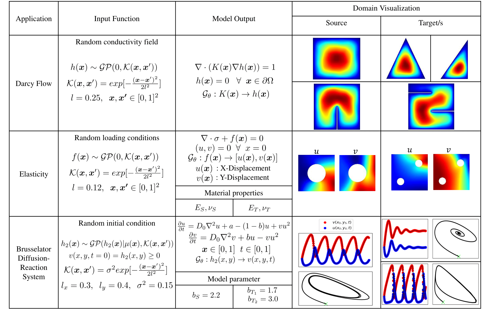

## Table of contents
* [General info](#general-info)
* [Method](#method)
* [Application](#application)
* [Contents](#contents)
* [Clone](#clone)
* [Contact](#contact)

## General info

This Git repository contains codes for the **'Deep transfer operator learning for partial
differential equations under conditional shift'** manuscript.

Authors: [Somdatta Goswami](https://scholar.google.com/citations?user=GaKrpSkAAAAJ&hl=en&oi=sra), [Katiana Kontolati](https://scholar.google.com/citations?user=n8wtUDYAAAAJ&hl=en&oi=sra), [Michael D. Shields](https://scholar.google.com/citations?user=hc85Ll0AAAAJ&hl=en), [George Em Karniadakis](https://scholar.google.com/citations?user=yZ0-ywkAAAAJ&hl=en)

## Method

The key idea behind **transfer learning** is learning machines that leverage knowledge gained from one task to improve accuracy and generalization in another different but related task.

Physics-based systems often require the accurate solution of PDEs that are related but differ in a certain aspect, i.e., there exists a **conditional distribution mismatch**.

In our latest work, we propose a novel framework which exploits information from pre-trained (source) deep neural operators (DeepONets), for fast and accurate task-specific partial differential equation (PDE) learning (target).

The key ingredients of this approach are:
* the extraction of domain-invariant features, 
* the embedding of conditional distributions on a reproducing kernel Hilbert space (RKHS) and 
* the self-adaptive learning of penalizing parameters which allows adaptation between source and target domains.

<p align="center">
  
</p>

## Application

As presented in the Table below, we demonstrate the capabilities of our approach on three classes of PDE problems where domains and physical parameters have significant differences.

<p align="center">
  
</p>

We transfer information from the trained source model (DeepONet) to the target model (DeepTONet) and finetune it via the hybrid loss function, which allows for efficient multi-task operator learning under various distribution mismatch scenarios. 

## Contents

* ```data_generation/``` - contains script (in Python and Matlab) to generate labeled data for all three PDE applications.

* ```TL{1-6}/``` - contains python scripts and notebooks for implementing the proposed transfer learning approach. As a first step, the ```source_model.py``` script needs to be executed. The optimized source model parameters are saved inside a local folder ```Variables/```. Finally, the ```target_model.py``` script can be used for fine-tuning of the target model for each target PDE task.

## Clone

To clone and use this repository, run the following terminal commands:

```
git clone https://github.com/katiana22/TL-DeepONet.git
cd TL-DeepONet
pip install -r requirements.txt
```
______________________

### Contact
For more information or questions please contact us at:   
* kontolati@jhu.edu   
* somdatta_goswami@brown.edu
