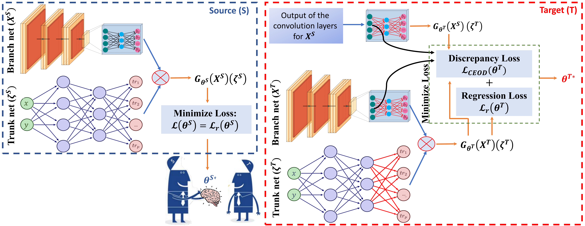
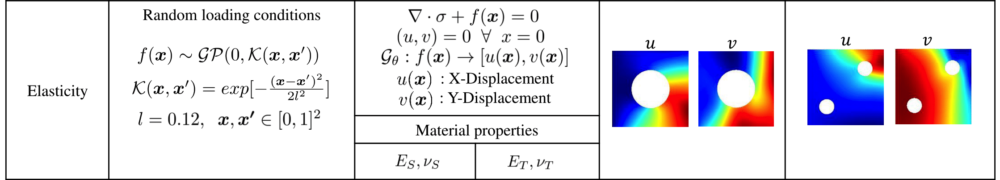

## Table of contents
* [General info](#general-info)
* [Method](#method)
* [Application](#application)
* [Contents](#contents)
* [Datasets](#datasets)
* [Clone](#clone)

## General info

This Git repository contains codes for the **'Deep transfer operator learning for partial
differential equations under conditional shift'** paper which can be found here: [https://arxiv.org/abs/2204.09810](https://arxiv.org/abs/2204.09810).

Authors: [Somdatta Goswami](https://scholar.google.com/citations?user=GaKrpSkAAAAJ&hl=en&oi=sra), [Katiana Kontolati](https://scholar.google.com/citations?user=n8wtUDYAAAAJ&hl=en&oi=sra), [Michael D. Shields](https://scholar.google.com/citations?user=hc85Ll0AAAAJ&hl=en), [George Em Karniadakis](https://scholar.google.com/citations?user=yZ0-ywkAAAAJ&hl=en)

## Method

The key idea behind transfer learning is learning machines that leverage knowledge gained from one task to improve accuracy and generalization in another different but related task.

Physics-based systems often require the accurate solution of PDEs that are related but differ in a certain aspect, i.e., there exists a conditional distribution mismatch.

In our latest work, we propose a novel framework which exploits information from pre-trained (source) deep neural operators (DeepONets), for fast and accurate task-specific partial differential equation (PDE) learning (target).

The key ingredient of this approach is the extraction of domain-invariant features, the embedding of conditional distributions on a reproducing kernel Hilbert space (RKHS) and the self-adaptive learning of penalizing parameters which allows adaptation between source and target domains.

<p align="center">
  
</p>

## Application

We consider a thin rectangular plate subjected to in-plane loading that is modeled as a two-dimensional problem of plane stress elasticity. We model the loading conditions applied to the right edge of the plate, as a Gaussian random field, and we aim to learn the mapping from the random boundary
load, to the displacement field. We consider the following transfer learning scenario:
* Transfer learning from displacement fields with a centered hole and material properties (E_S, ν_S) to displacement fields with two smaller holes in the upper right and lower left corners and different material properties (E_T , ν_T).

<p align="center">
  
</p>

We transfer information from the trained source model (DeepONet) to the target model (DeepTONet) and finetune it via the hybrid loss function. For more details, refer to the [paper](https://arxiv.org/abs/2204.09810).

## Contents

* ```data``` - contains files with the input random field data used to generate the train and test data of the model

* ```main_{}.py```/ ```main_{}.ipynb``` - contains python scripts and notebooks for implementing the proposed approaches

## Datasets

Datasets can be found inside the folder ```data/```.

## Clone

To clone and use this repository, run the following terminal commands:

```
git clone https://github.com/katiana22/surrogate-overparameterization.git
cd surrogate-overparameterization
pip install -r requirements.txt
```

## Citation

If you find this GitHub repository useful for your work, please consider citing this work:

```
@article{goswami2022deep,
  title={Deep transfer learning for partial differential equations under conditional shift with DeepONet},
  author={Goswami, Somdatta and Kontolati, Katiana and Shields, Michael D and Karniadakis, George Em},
  journal={arXiv preprint arXiv:2204.09810},
  year={2022}
}
```
______________________

### Contact
For more information or questions please contact us at:   
* kontolati@jhu.edu   
* somdatta_goswami@brown.edu
